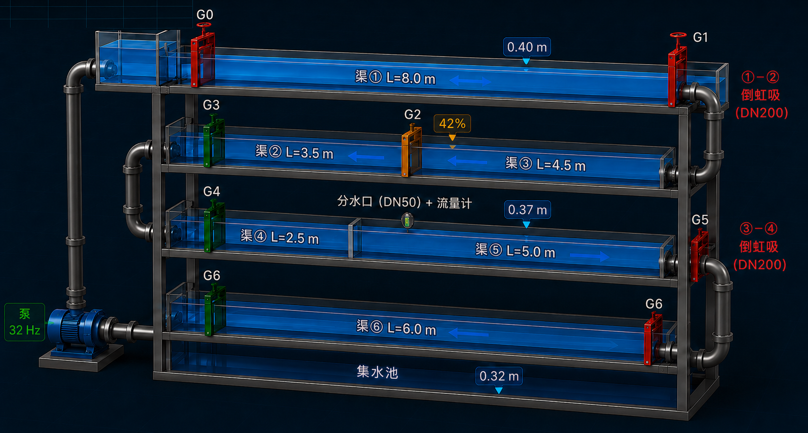

## 项目概述：

1. 显示三维模型能切换视图，要能手动旋转，能主动漫游，有基本动画效果，

2. 对接数据点300-400 展示实时数据在三维模型上  

3. 显示连接状态 

4. 显示各传感器的数据变化曲线图  

5. 手动对闸门下发开度指令 

6. 历史数据的查询下载。

   三维图如下所示：

## 页面要求

### 实时监控页面

1、根据工艺图生成页面，工艺图显示在中间 并显示实时的闸前水位、闸后水位、闸门开度、泵频率等信息，实现鼠标旋转、缩放、平移全自由交互，主动漫游；闸门启闭、水位涨跌、设备启停动态仿真动画，
2、下方以多个标签形式切换显示
      第一个标签，显示各节点水位曲线图，各节点显示闸门、渠道、倒虹吸显示各渠道水位实时变化
      第二个标签，显示各流量计的按时间变化图表。
      第三个标签，显示各水位计按时间变化的曲线图表。
      第四个标签，显示泵频率的按时间变化的曲线图表。
      第五个标签、显示各倒虹吸的按时间变化的曲线图表。
3、左上方显示各闸门的实时开度和连接状态，右下方显示各水位计、流量计、压力计的连接状态及实时数值。设备高亮、异常闪烁聚焦效果，设备在线/离线/异常三色状态标识
4、右边  1、显示手动控制设备，可调节各闸门的开度、水泵的频率，2、显示报警信息、报警的时间

### 历史数据查看
1、根据时间段、设备类型、设备名称进行查询 显示 表格 和 曲线变化图表，导出csv文件的功能 可显示多个设备
2、多点位同屏曲线对比分析；曲线缩放、平移、刷新重置功能
3、根据时间段 在一张表格中显示各时间点的各传感器的实时数据，并显示各传感器隶属于哪个渠道， 并实现导出csv文件的功能。通过曲线图+时间轴的形式  显示各节点水位曲线图，各节点显示闸门、渠道、倒虹吸显示各渠道水位实时变化。  

### 报警数据查看
1、根据时间段、报警类型、报警信息、已处理，未出理的状态， 进行查询 并实现处理功能。